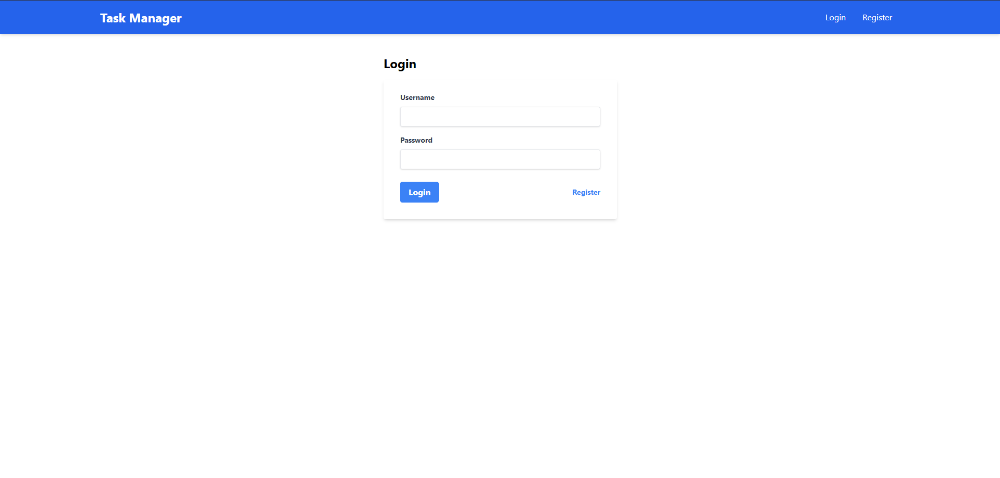
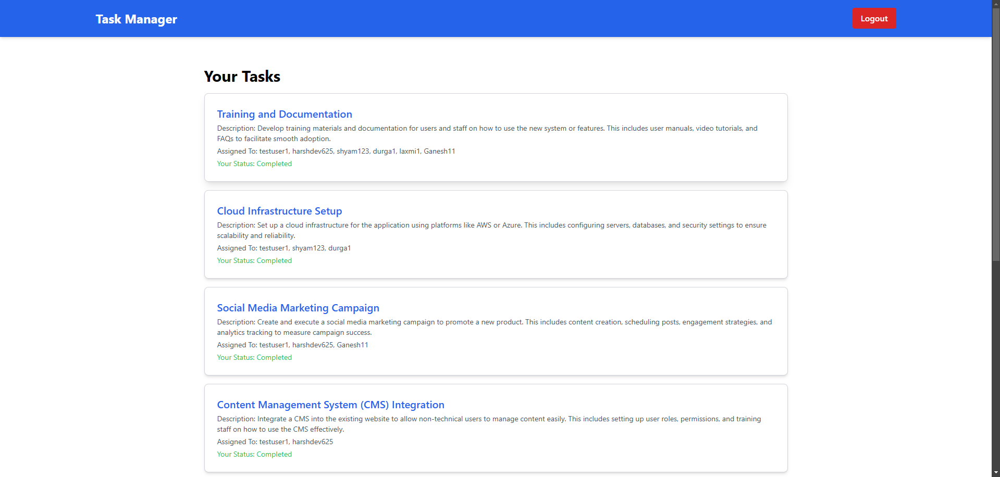
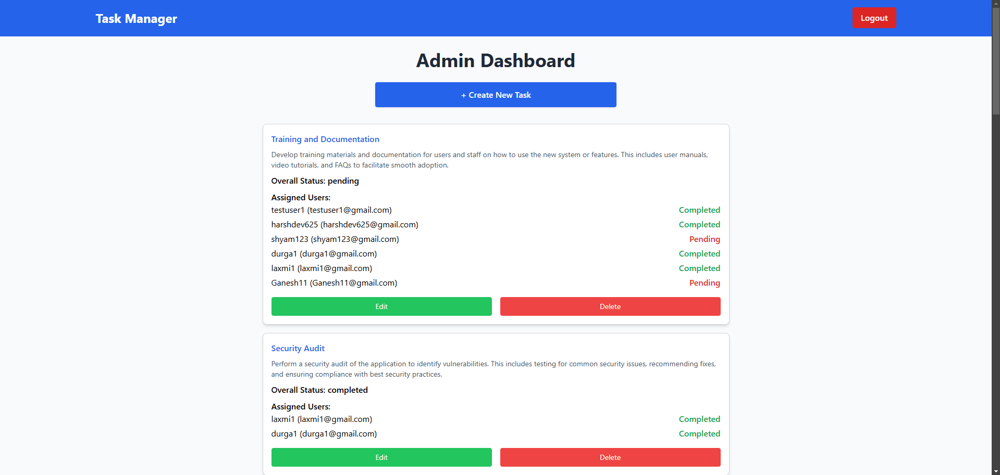
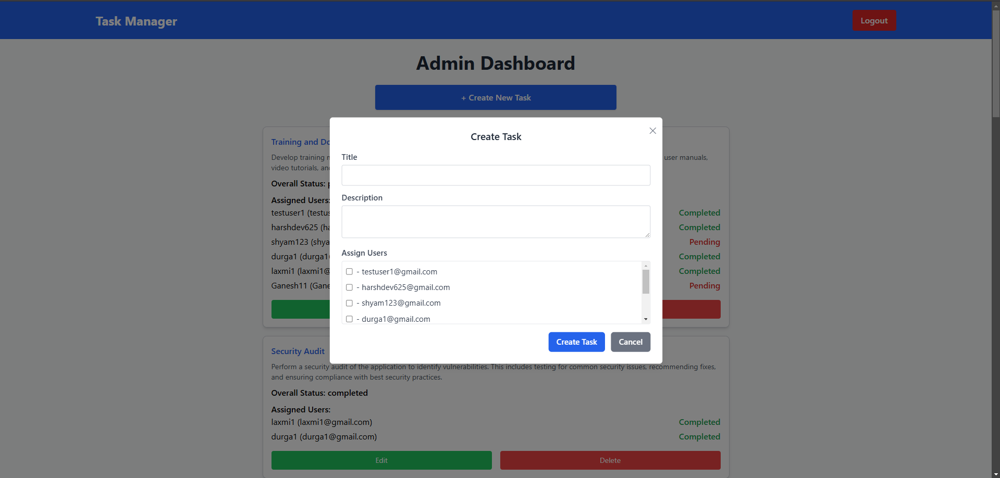

# StarkTasks - A Task Management Web App

StarkTasks is a frontend application built using React, Redux Toolkit, Axios, and Tailwind CSS, designed for managing tasks with user authentication and role-based access.

## Table of Contents

- [Features](#features)
- [Technologies Used](#technologies-used)
- [Installation](#installation)
- [Usage](#usage)
- [Folder Structure](#folder-structure)
- [API Endpoints](#api-endpoints)
- [Contributing](#contributing)
- [License](#license)

## Features

- **User Authentication**: Users can register, log in, and log out. Authentication is handled using JWT tokens.
- **Role-based Access Control**: Different functionalities are available based on user roles (admin and user).
- **Task Management**:
  - **Users** can view, mark tasks as complete, and see their assigned tasks.
  - **Admins** can create, update, delete tasks, and assign tasks to users.
- **Notifications**: Real-time notifications using React Toastify for user actions such as task completion and deletions.
- **Responsive Design**: The application is styled with Tailwind CSS for a modern and responsive user interface.

## Technologies Used

- **React**: A JavaScript library for building user interfaces.
- **Redux Toolkit**: For state management.
- **Axios**: For making HTTP requests to the backend API.
- **React Router**: For navigation between different pages.
- **React Toastify**: For displaying notifications.
- **Tailwind CSS**: For styling the application.
- **React Modal**: For modal dialogs.

## Installation

1. Clone the repository:

   ```bash
   git clone https://github.com/Harshdev625/StarkTasks
   cd StarkTasks/frontend
   ```

2. Install dependencies:

   ```bash
   npm install
   ```

3. Run the application in development mode:

   ```bash
   npm run dev
   ```

4. Open your browser and navigate to `http://localhost:5173` (or the specified port in your Vite config).

## Usage

1. **Registration**: New users can create an account via the registration page.
2. **Login**: Users can log in using their credentials.
3. **User Dashboard**: Users can view their tasks, mark them as complete, and see the status of their assignments.
4. **Admin Dashboard**: Admins can manage tasks, including creating, updating, and deleting tasks, as well as assigning them to users.
5. **Notifications**: Users will receive notifications for actions taken, such as task completions and deletions.

## Folder Structure

```
src/
├── components/         # Contains reusable components (e.g., Navbar, NotFound)
├── pages/              # Contains page components (e.g., UserDashboard, AdminDashboard, Login, Register, TaskForm)
├── redux/              # Redux slices for managing application state
│   ├── authSlice.js
│   ├── taskSlice.js
│   └── store.js
├── App.js              # Main application component
└── index.js            # Entry point of the application
```

## API Endpoints

This frontend application communicates with the backend API for the following operations:

- **Authentication**:
  - `POST /api/auth/register`: Create a new user.
  - `POST /api/auth/login`: Log in a user and return a token.

- **Tasks**:
  - `GET /api/tasks`: Fetch all tasks.
  - `POST /api/tasks`: Create a new task.
  - `PATCH /api/tasks/:id`: Update an existing task.
  - `DELETE /api/tasks/:id`: Delete a task.

## Screenshots

### **Login Page**


### **User Dashboard**


### **Admin Dashboard**


### **Create Task UI**


## Contributing

Contributions are welcome! Please open an issue or submit a pull request for any enhancements or bug fixes.

## License

This project is licensed under the MIT License. See the LICENSE file for details.